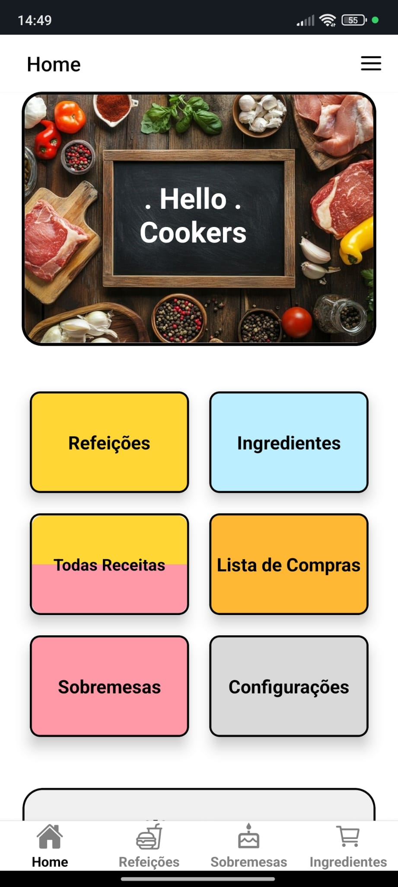
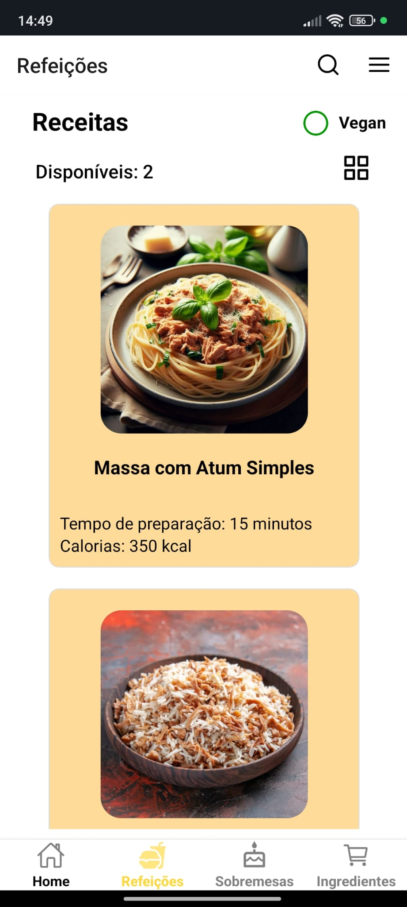

# RecipeNest - App de Receitas

**RecipeNest** é um aplicativo de receitas desenvolvido com **React Native** e **Expo** por [Diogo Ribeiro](https://github.com/DIOGO4810) e
[Carolina Martins](https://github.com/Carolllina)
 projetado para ajudar os usuários a encontrar, salvar e organizar receitas de forma simples e intuitiva. O app utiliza o `expo-sqlite` para armazenar dados localmente.


## Sobre o Projeto

O **RecipeNest** foi desenvolvido com o objetivo de criar uma plataforma inteligente de sugestões de receitas. O app permite que os usuários **adicionem ingredientes** que têm disponíveis em casa, e, com base nesses ingredientes, ele sugere **receitas** que podem ser preparadas. Além disso, o app oferece as seguintes funcionalidades:

- **Refeições**: Uma página que lista de refeições com informações detalhadas.
- **Sobremesas**: Uma página específica para receitas de sobremesas com informações detalhadas.
- **Frigorífico**: Uma lista dos ingredientes que o usuário possui no momento, ajudando a otimizar o planejamento das receitas.
- **Lista de compras**: Permite que o usuário adicione itens à lista de compras de acordo com as receitas selecionadas.

A aplicação foca em proporcionar uma experiência prática e personalizada para quem deseja cozinhar com o que tem disponível em casa.

## Tecnologias Utilizadas

- **React Native**: Biblioteca principal para o desenvolvimento do app.
- **Expo**: Framework para facilitar o desenvolvimento em React Native.
- **expo-sqlite**: Biblioteca para gerenciar banco de dados SQLite no dispositivo.
- **React Navigation**: Para navegação entre telas.

## Instalação
```bash
git clone https://github.com/seu-usuario/RecipeNest.git  
cd RecipeNest
npm install
```

## Como usar
```bash
npx expo start
```
**(Android)** - Instalar Expo go e scanear o QRcode  
**(Ios)** - Scanear o QRcode


## Preview da App
- **Home page**

- **Meal page**


